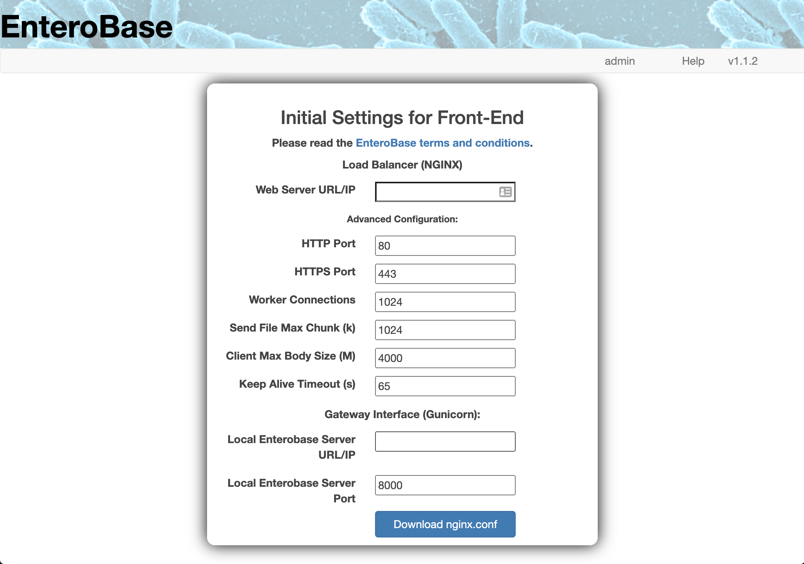

.. _nginx-installation-label:

NGINX Prerequisite Resources
^^^^^^^^^^^^^^^^

NGINX will act as a reverse-proxy, and load balancer for Local EnteroBase. It will serve requests to the website to all the servers it is installed on. This page guides you through the creation of the resources required to install and configure NGINX. It is important to have these resources ready before continuing with the installation process, especially if you choose the "Automatic Installation" option.

NGINX Resource Directory Structure
================
  ::
 
    nginx
	|-- nginx.conf
	|-- certs
	| |-- cert.pem
	| |-- key.pem
	|-- logs
	  |-- local_enteroBase_access.log
	  |-- local_enteroBase_error.log
 

"nginx.conf"
================

The "nginx.conf" file is the configuration file used by NGINX. It defines a number of features of the web server, most importantly the URL or IP address it receives requests from and the URL or IP address it forwards them to. You can learn more about the nuances of this file on the NGINX "Beginner's Guide" available at: `<http://nginx.org/en/docs/beginners_guide.html>`_. In order to make the task of creating this file a bit easier, we have provided a webpage which takes some inputs and generates the "nginx.conf" file for you. This webpage is available at: `<http://35.246.24.128:5569/local_enterobase/nginx_config>`_.

   **Fig. 1 - NGINX Configuration Form**
   
The above figure shows the form that is used to generate the "nginx.conf" file. All fields in the form are mandatory, however, most come with default values which you can (and probably should) keep as they are. The only values that are definitely unique to your installation are the "Web Server URL/IP" and "Local Enterobase Server URL/IP" values. Below are some short descriptions of the required variables:

* **Web Server URL/IP**: URL or IP address for the NGINX server hosting your local Enterobase instance. This value is most likely going to be the IP address of your server, which you can find by running the command: ``curl https://ipinfo.io/ip``.
* HTTP Port: Port number for http access to your local Enterobase instance (default=80).
* HTTPS Port: Port number for https access to your local Enterobase instance (default=443).
* Worker Connections: The maximum number of parallel connections the local Enterobase instance can handle (default=1024).
* Send File Max Chunk (k): The maximum amount of data that can be sent with a single send_file() call in kilobytes (default=1024).
* Client Max Body Size (M): The maximum upload file size the local Enterobase instance can handle in megabytes (default=4000).
* Keep Alive Timeout (s): How long the TCP connection between the client and the server stays open after an HTTP transaction has been completed in seconds (default=1500).
* **Local Enterobase Server URL/IP**: The URL or IP of the server facilitating the assembly of short reads. This value will be the same as the "Web Server URL/IP" value if you have installed them on the same server.
* Local Enterobase Server Port: The port of the server facilitating the assembly of short reads (default=8000).

For more information on these values please visit the NGINX docs, available at: `<http://nginx.org/en/docs/http/ngx_http_core_module.html>`_.
